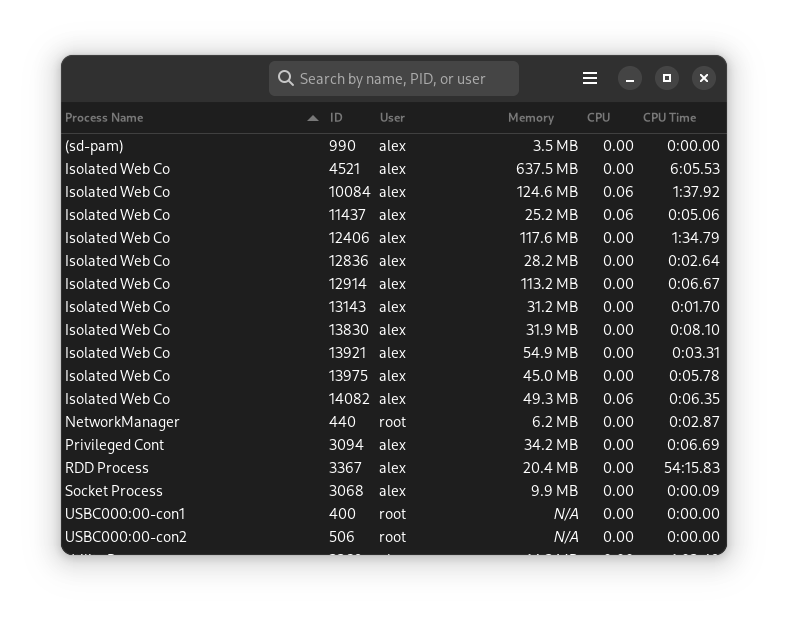

# peek

  

Peek is process monitoring application that allows linux users to inspect active processes on their system. It uses GNOME's [glib](https://github.com/GNOME/glib) and [glibtop](https://github.com/GNOME/libgtop) libraries to interface with the system and [gtk](https://github.com/GNOME/gtk) as well as [adwaita](https://gnome.pages.gitlab.gnome.org/libadwaita/doc/main/index.html) to construct a user interface.

This project was created to showcase my knowledge of the GTK library and explore an interest of the inner working of the linux operating system. Every operating system I have worked with (Windows, Linux & macOS) provided a visual of the active processes within the system and I thought it would be cool to figure out how this data is obtained and design my own interface for it. I discovered that reading process information is not as straight forward as you would think due to the way it is exposed by the kernel. On linux, the kernel exposes a virtual filesystem of process information that can be found at /proc (a window of sorts to the process activity inside the kernel). Previous experience suggested that I make the application event driven for updates to the active processes, but the API for monitoring directories and files for changes, [inotify(7)](https://www.man7.org/linux/man-pages/man7/inotify.7.html), does not allow for monitoring of virtual filesystems. This changed a portion of the application design to poll at a defined interval.

Obtaining the process data was made easy with the _libgtop_ API's. I had spent several hours trying to work with the _libprocps_ library, another process monitoring library (see [readproc(3)](https://manpages.debian.org/testing/procps/readproc.3.en.html)), with limited success.

While researching how this project could be completed with the GTK library, I came across the repository for the current version of [gnome-system-monitor](https://gitlab.gnome.org/GNOME/gnome-system-monitor/-/tree/master). The work of the development team really helped me advance my understanding of the gobject, glib and gtk libraries when I got confused by the docs. The repository also provided calculations of CPU utilization that simplified my implementaion.

## Building the Project
To build peek and try it for yourself, there are a couple dependencies!
### Dependencies
- [Meson](https://mesonbuild.com/Getting-meson.html) build system
- [libadwaita-1](https://gnome.pages.gitlab.gnome.org/libadwaita/doc/main/index.html)
- libgtop-2.0
### Building & Installing
1. Navigate to the root of the project on your command line and run `meson compile -C build` to build the application (see [commands](https://mesonbuild.com/Commands.html) for more options). The compiled binary can be found at `build/src`.
2. GSettings need to be installed before the application will run. The application can be installed with `meson install -C build --no-rebuild`
   - Alternatively, you can use the command `meson install -C build` to compile the sources and install the application with a single command.
3. To run the application, type `peek` on the command line or execute the binary at `build/src`.
